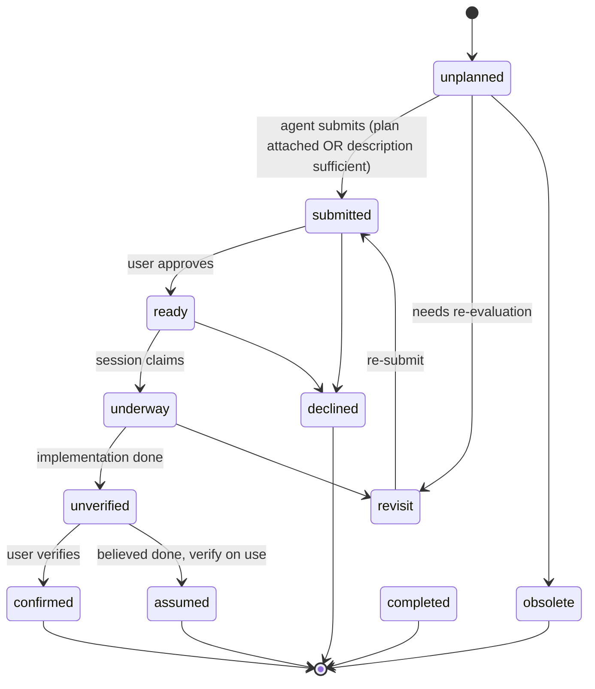

# Endless — Manage 50+ Claude Code tasks without going insane

Endless is a project awareness system for solo developers running many software
projects with AI assistants. It keeps track of **what you're working on**,
**why**, and **whether you declared your intent** before making changes — so you
can juggle a myriad of projects with AI without losing the thread on any of them.

It provides:

- A **task tree** — hierarchical items representing what needs to be done, across
  every registered project.
- **Decisions** as first-class artifacts — the rationale that lives alongside tasks,
  not lost in chat scrollback.
- **Per-task git worktrees** — each task's work happens on its own isolated branch,
  so `main` stays clean and sessions run in parallel without stepping on each other.
- **Session tracking** — records which AI session is working on which task.
- **Enforcement** (optional) — a hook that can block Write/Edit until you claim a task.
- A **web dashboard** at `http://localhost:8484` (start with `endless serve`).

Endless is in active development — expect rough edges, expect change. Honest
feedback on friction is welcome: when something is wrong or surprising, say so.

## Install

```bash
just install
```

This builds the Go binaries to `./bin/`, symlinks them to `/usr/local/bin/`, and
installs the Python CLI via `uv tool`.

To build without installing, or to run the tests:

```bash
just build    # templ generate, tailwind CSS, Go binaries
just test     # run Python tests
```

Endless depends on a [fork of `modelcontextprotocol/go-sdk`](https://github.com/mikeschinkel/go-mcp-sdk/tree/send-notification) via a `replace` directive in `go.mod`, pending upstream merge of [PR #844](https://github.com/modelcontextprotocol/go-sdk/pull/844). If `go mod tidy` fails with a `sum.golang.org` 404, set `GOPRIVATE` once to bypass the public checksum database for the fork:

```bash
go env -w GOPRIVATE=github.com/mikeschinkel/*
```

## Getting started

Point Endless at a project, give it something to do, and watch it in the dashboard.

```bash
# 1. Register the current directory as a project (auto-detect metadata).
cd ~/Projects/myapp
endless project register --infer

# 2. Add a task.
endless task add "Build the login flow" --description "Email + password auth"

# 3. See what's on your plate, across all projects.
endless task show --all

# 4. Open the dashboard.
endless serve            # then visit http://localhost:8484
```

From here, day-to-day work flows through claiming a task (which creates its
worktree), doing the work on that branch, marking it for verification, and landing
it. The full loop — and the way Endless is designed to be driven by an AI coding
session — is covered in the guide below.

## Task lifecycle

Every task moves through a small set of statuses. An agent moves a task to
`submitted` (by attaching a plan, or via `endless task submit` when the description
is a sufficient spec); a human runs `endless task approve` to reach `ready`. So
`ready` provably means *approved to implement*, not merely *planned*.

<!-- BEGIN canonical:docs/status-lifecycle.mmd — edit the canonical file, then re-sync; do not hand-edit here -->

<!-- END canonical:docs/status-lifecycle.mmd -->

## Digging deeper

The full reference — project and task management, documents and notes, the web
dashboard, hooks, session orchestration, and the underlying data model — lives in
the guide:

```bash
endless guide              # the main guide
endless guide --list       # list every topic
endless guide tasks        # a specific topic
```

The guide is written for an AI coding session driving Endless, but it's the most
complete and up-to-date reference for humans too. Start there when you want more
than the getting-started path above.

## Roadmap & vision

- [`ROADMAP.md`](ROADMAP.md) — what exists today versus what's planned, for anyone
  who wants to use, suggest improvements for, or contribute to Endless.
- [`VISION.md`](VISION.md) — the envisioned end state: what we imagine Endless
  becoming.
