# Endless — Manage 50+ AI tasks without becoming overwhelmed

Endless lets one developer run many Claude Code sessions at once — each tracked by
an Endless "task" and with its own Git worktree and its own config/DB sandbox, so
nothing collides. You have Claude file a task, collaborate on a plan, then spawn the
plan into a new Claude session.

Then, when Claude has finished implementation it hands back a runnable verification
script for you to check and then merge the branch back into the main Git branch. A
live session monitor view shows every session at a glance.

This is all built on plain Git and an append-only ledger. You collaborate with
others on any project simply by pushing and pulling commits and allowing Endless to
orchestrate the rest.

Endless is in active development — expect rough edges, expect change. Honest
feedback on friction is welcome: when something is wrong or surprising, say so.

## Prerequisites

Endless drives a toolchain rather than replacing it. Install these and have them on
your `PATH` before building:

- **[git](https://git-scm.com/)** and **[tmux](https://github.com/tmux/tmux)** — tmux is
  required at runtime, not just for the layout below: `spawn`, session navigation, and
  inter-session messaging all refuse to run without it.
- **[just](https://github.com/casey/just)** — the command runner used for build/install.
- **[Go](https://go.dev/) 1.26+** — builds the Go binaries.
- **[uv](https://github.com/astral-sh/uv)** with **[Python](https://www.python.org/) 3.12+** — runs and installs the Python CLI.
- **[sqlite3](https://www.sqlite.org/)** and **[jq](https://jqlang.org/)** — used by tooling and the verification scripts.

Endless does not yet install these for you; wiring up prerequisite setup that
respects your existing package manager (Homebrew, asdf/mise, system packages, …) is
planned.

## Install

```bash
just install
```

This builds the Go binaries to `./bin/`, symlinks them to `/usr/local/bin/`, and
installs the Python CLI via `uv tool`.

To build without installing, or to run the tests:

```bash
just build    # Go binaries
just test     # run Python tests
```

Endless depends on a [fork of `modelcontextprotocol/go-sdk`](https://github.com/mikeschinkel/go-mcp-sdk/tree/send-notification) via a `replace` directive in `go.mod`, pending upstream merge of [PR #844](https://github.com/modelcontextprotocol/go-sdk/pull/844). If `go mod tidy` fails with a `sum.golang.org` 404, set `GOPRIVATE` once to bypass the public checksum database for the fork:

```bash
go env -w GOPRIVATE=github.com/mikeschinkel/*
```

## Getting started

Point Endless at a project, give it a task, and work that task in its own session.

```bash
# 1. Register the current directory as a project (auto-detect metadata).
cd ~/Projects/myapp
endless project register --infer

# 2. Add a task.
endless task add "Build the login flow" --description "Email + password auth"

# 3. See your tasks — the full list, or just the most recently touched.
endless task list
endless task recent

# 4. Read one task in detail.
endless task show E-123

# 5. Spawn a task into its own Claude session — its own tmux window, git
#    worktree, and sandbox, with a generated handoff as the opening prompt.
endless task spawn E-123
```

### Watching your sessions

```bash
endless session status     # one-shot snapshot of the current session's focal task
endless session monitor    # the same view kept live, like `top`; Ctrl-C to exit
```

### Working layout

Endless is meant to be driven from tmux. The layout we use is a single window split
into three panes:

- **Left** — your Claude Code session, doing the work.
- **Top right** — `endless session monitor`, redrawing as your sessions change state
  so you can watch every session at a glance.
- **Bottom right** — a free shell for ad-hoc `endless` commands.

`endless task spawn` opens each task's session in its own tmux window and builds
this three-pane layout for you — you land in the Claude pane with the monitor
already running beside it. The monitor keeps its pane exactly as tall as the rows
it has to show, so the shell below it gets everything left over. Shipping the tmux
configuration Endless needs alongside the repo is still in progress.

### Exploring the CLI

Every command and subcommand self-documents with `--help`:

```bash
endless --help
endless task --help
endless task spawn --help
```

## Task lifecycle

Every task moves through a small set of statuses. New tasks start `untriaged`; triage
routes each one to `unplanned` (it still needs a plan) or straight to `submitted` (its
description is already a sufficient spec). That routing is automatic — filing a task
triages it in the background, and a periodic sweep drains anything missed — and it can
always be overridden by hand. An agent also reaches `submitted` by attaching a plan.
From there a human runs `endless task approve` to reach `ready` — so `ready` provably
means *approved to implement*, not merely *planned*.

```mermaid
%% Canonical task status lifecycle.
%%
%% GENERATED, in part. The states and edges below are rendered from the
%% transition table in internal/taskstatus/transitions.go — the table is the
%% source of truth, this picture is its artifact. Do not hand-edit inside the
%% BEGIN/END generated markers; edit the Go table and run `just lifecycle-index`.
%% `just lifecycle-check` exits non-zero when the committed artifact has drifted,
%% and `just test` asserts the same thing, so a table edited without
%% regenerating fails the suite rather than shipping a picture that lies.
%%
%% This preamble is hand-written and survives regeneration, the same split
%% `just guide-index` uses for docs/guide/index.md.
%%
%% Embedded byte-identically in README.md and docs/guide/index.md between
%% <!-- BEGIN canonical:docs/status-lifecycle.mmd --> / <!-- END ... --> markers;
%% `just lifecycle-index` rewrites those copies too, and
%% tests/test_status_lifecycle_sync.py asserts all three stay in step.
%%
%% Two things this diagram deliberately does not draw:
%%   - Blocking. It is the `blocked_by` relation, computed from the blocker's
%%     own status, never a state a task sits in. There is no `blocked` status.
%%   - Epic status. It is derived from an epic's children and written directly,
%%     so an epic can arrive at any of its ladder's statuses from any other.
%%     Drawing that would be drawing the derivation algorithm, not a lifecycle.
%%
%% BEGIN generated: rendered from internal/taskstatus/transitions.go
stateDiagram-v2
    [*] --> untriaged

    %% Triage — the description is judged, and routed
    untriaged --> unplanned: agent triages — needs a plan
    untriaged --> submitted: agent triages — description is a sufficient spec

    %% Planning and approval — the two-step gate that makes `ready` mean approved
    unplanned --> submitted: agent submits — plan attached, or description sufficient
    submitted --> ready: user approves
    submitted --> unplanned: user sends back — the spec is not sufficient
    revisit --> submitted: agent re-submits

    %% Planning exemption — a tier-1 task skips both planning and triage
    untriaged --> ready: system advances a tier-1 task
    unplanned --> ready: system advances a tier-1 task

    %% Re-spec — a material description edit invalidates triage and approval
    unplanned --> untriaged: system resets on a description re-spec
    submitted --> untriaged: system resets on a description re-spec
    ready --> untriaged: system resets on a description re-spec
    revisit --> untriaged: system resets on a description re-spec
    ready --> submitted: system resets on a description re-spec that attaches a plan

    %% Claiming — `task claim` promotes any of these in place
    ready --> underway: session claims
    untriaged --> underway: session claims
    unplanned --> underway: session claims
    revisit --> underway: session claims

    %% Implementation lane — work whose deliverable is testable behavior
    underway --> unverified: session reports implementation done (todo/bugfix)
    unverified --> confirmed: user verifies (todo/bugfix)
    unverified --> assumed: agent believes done, verify on use (todo/bugfix)
    underway --> confirmed: user verifies work still in flight (todo/bugfix)
    underway --> assumed: agent believes done, verify on use (todo/bugfix)

    %% Findings lane — work whose deliverable IS the outcome text
    underway --> unreviewed: agent delivers the findings as an outcome (research/brainstorm)
    ready --> unreviewed: agent delivers the findings as an outcome (research/brainstorm)
    unreviewed --> completed: user reads the outcome and accepts it (research/brainstorm)
    underway --> completed: agent delivers the findings as an outcome (epic)
    ready --> completed: agent delivers the findings as an outcome (epic)

    %% Reopening — the work is not settled after all
    untriaged --> revisit: agent reopens — needs re-evaluation
    unplanned --> revisit: agent reopens — needs re-evaluation
    submitted --> revisit: agent reopens — needs re-evaluation
    ready --> revisit: agent reopens — needs re-evaluation
    underway --> revisit: session hands the task back
    unverified --> revisit: user reopens — verification failed
    unreviewed --> revisit: user reopens — the outcome needs more work
    confirmed --> revisit: user reopens — shipped work found wrong
    assumed --> revisit: user reopens — shipped work found wrong
    completed --> revisit: user reopens — shipped work found wrong

    %% Declining — an active decision not to do (or not to keep) the work
    untriaged --> declined: user declines
    unplanned --> declined: user declines
    submitted --> declined: user declines
    ready --> declined: user declines
    underway --> declined: user declines
    revisit --> declined: user declines
    unverified --> declined: user declines — the shipped work is not being kept
    unreviewed --> declined: user declines — the shipped work is not being kept
    confirmed --> declined: user declines — the shipped work is not being kept
    assumed --> declined: user declines — the shipped work is not being kept
    completed --> declined: user declines — the shipped work is not being kept

    %% Obsoleting — no longer needed, and nothing replaced it
    untriaged --> obsolete: user retires — it no longer needs doing
    unplanned --> obsolete: user retires — it no longer needs doing
    submitted --> obsolete: user retires — it no longer needs doing
    ready --> obsolete: user retires — it no longer needs doing
    underway --> obsolete: user retires — it no longer needs doing
    revisit --> obsolete: user retires — it no longer needs doing
    unverified --> obsolete: user retires — the shipped work is no longer in use
    unreviewed --> obsolete: user retires — the shipped work is no longer in use
    confirmed --> obsolete: user retires — the shipped work is no longer in use
    assumed --> obsolete: user retires — the shipped work is no longer in use
    completed --> obsolete: user retires — the shipped work is no longer in use

    %% Superseding — something else took the work over
    untriaged --> superseded: user supersedes — another task took it over
    unplanned --> superseded: user supersedes — another task took it over
    submitted --> superseded: user supersedes — another task took it over
    ready --> superseded: user supersedes — another task took it over
    underway --> superseded: user supersedes — another task took it over
    revisit --> superseded: user supersedes — another task took it over

    %% Reversal — reconsidering an abandonment decision
    declined --> untriaged: user reconsiders
    obsolete --> untriaged: user reconsiders
    superseded --> untriaged: user reconsiders

    %% Terminal — the work is over, one way or another
    confirmed --> [*]
    assumed --> [*]
    completed --> [*]
    declined --> [*]
    obsolete --> [*]
    superseded --> [*]
%% END generated
```

<!-- BEGIN canonical:docs/status-lifecycle.mmd — edit the canonical file, then re-sync; do not hand-edit here -->

<!-- END canonical:docs/status-lifecycle.mmd -->

## Roadmap & vision

- [`ROADMAP.md`](ROADMAP.md) — what exists today versus what's planned, for anyone
  who wants to use, suggest improvements for, or contribute to Endless.
- [`VISION.md`](VISION.md) — the envisioned end state: what we imagine Endless
  becoming.
