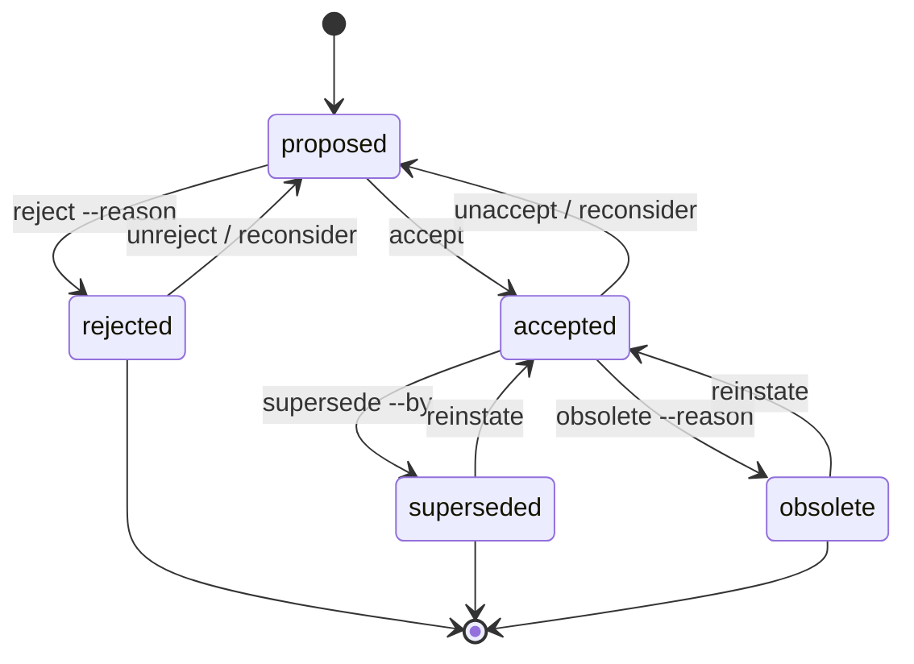

# Decisions

Decisions are first-class items in Endless. They live alongside tasks and capture *why* something is the way it is — choices about approach, scope, conventions, deferrals.

## STRONG guidance (read this before writing decisions)

**Always document decisions where applicable.** When you and your user resolve a non-obvious question — choosing between approaches, scoping in/out, picking conventions, deferring something to later — file it. Decisions you didn't write down will be re-argued in three weeks.

**Verify with your user before stating a decision as binding.** Especially: do **not** record a *prohibition* when your user only expressed a *preference*.

Soft signals (preferences, not rules):

- "Ideally we'd ..."
- "Usually we ..."
- "I'd prefer ..."
- "Most of the time, ..."
- "Let's try ..."

Hard signals (rules):

- "Never do X."
- "Always X."
- "X is required."
- "Don't ship without X."
- Direct acceptance after explicit "should this be a rule?"

When you're not sure which you heard, **ask before writing**. A wrongly-recorded prohibition is harder to recover from than an undocumented preference — the prohibition gets cited as authority in future sessions, calcifies, and becomes part of "how things are."

**Don't self-cite.** If you wrote a decision yesterday and you're now treating it as established convention, verify with `git blame` or with your user first. Your own prior plans are not authority (see also the user's session-memory notes if any).

## Pairing a decision to its task is the preferred form

The cheapest way to record a decision is to tie it to the task that prompted it, with `--about`:

```bash
endless decision add "Statement of the decision" --about <id>
```

`--about` links the new decision to the originating task via a `documents` relation, so the decision is searchable, reviewable, and tied to context. It's repeatable, and can be combined with `--decides` (see below).

## The full form

The same command takes a longer description and additional links — use `--decides` for a decision that settles a task, and omit `--about` for a cross-cutting choice with no single triggering task:

```bash
endless decision add "Statement of the decision" \
    --description "Longer explanation if needed" \
    --about <task_id>     # task this decision documents (soft link, repeatable)
    --decides <task_id>   # task this decision settles (hard link, repeatable)
```

Decision titles should state the decision directly. **Do not** start with "Record that ...". Decision titles skip the verb-first validation since they're statements, not actions.

Examples of good decision titles:

- `Use --type for relation-type flag on task link/unlink`
- `Project-config writes resolve to cwd-local, not anchored to main`
- `Allow tracking field to be set in global config as a default`

Examples of bad decision titles:

- "Decided on the approach" (vague)
- "Record that we picked X" (don't start titles with "Record that")
- "User prefers X" (a preference voiced by one person isn't a decision; if it's a rule, state the rule directly)

## Viewing and linking

```bash
endless decision list                            # decisions for current project
endless decision list --agent                    # token-efficient
endless decision show <id>
endless decision link <a> --to <b> --type ...    # decision-to-decision typed link
endless decision unlink <a> --to <b> --type ...
endless decision list --agent | grep superseded  # what stopped governing, and what took over
```

## Decision status

A decision starts `proposed`, is settled as `accepted` or `rejected`, and — if it was accepted — may later stop governing:



Status changes use dedicated verbs, not `decision update` (which only edits title/description).

### Settling it: accepted or rejected

```bash
endless decision accept <id>                     # proposed → accepted
endless decision reject <id> --reason "..."      # proposed → rejected (reason is stored)
```

Both settled statuses are reversible. A decision is never "open", so there is no `reopen` — each reversal names the status it undoes:

```bash
endless decision unaccept <id>                   # accepted → proposed
endless decision unreject <id>                   # rejected → proposed (clears the stored reason)
endless decision reconsider <id>                 # whichever of the two applies
```

`unaccept` and `unreject` refuse if the decision isn't in the status they undo — so if you believe ED-42 was accepted and it was actually rejected, `unaccept ED-42` tells you rather than quietly performing the other reversal. Reach for `reconsider` when you don't care which way it went and just want the decision back on the table.

Unrejecting clears `rejection_reason` from the row, since a decision back in `proposed` has not been rejected. The reason isn't lost — it stays in the `decision.rejected` entry in the event ledger.

### Retiring it: superseded or obsolete

An accepted decision governs until something stops it. **Say which**, or the record keeps reading as current long after it isn't — and the next session cites it at you with total confidence:

```bash
endless decision supersede <id> --by <new_id>    # accepted → superseded (names the successor)
endless decision obsolete <id> --reason "..."    # accepted → obsolete (says what went away)
```

- **`superseded`** — a newer decision took over. The successor is recorded as a `supersedes` relation, so `decision show` names it inline (`superseded (by ED-101)`) and `decision list --agent` / `--json` carry it. The human `decision list` table renders the bare status: one shared Status column across every row cannot be sized by a handful of annotated cells. Use this whenever there IS a replacement, even one that refines rather than contradicts.
- **`obsolete`** — it stopped applying and nothing replaced it, because the code, feature or constraint it governed is simply gone. `--reason` is required: it is the only thing distinguishing a rule you retired deliberately from one that quietly stopped being mentioned.

Both apply **only to `accepted` decisions**, and that restriction is the point: only an accepted decision ever governed, so only an accepted decision can stop. A `proposed` decision that turned out not to matter was never in force — reject it, or leave it. A `rejected` one never took effect and has nothing to retire.

Retirement is reversible, and one verb covers both — there is only ever one status to go back to:

```bash
endless decision reinstate <id>                  # superseded | obsolete → accepted
```

`reinstate` drops the `supersedes` relation and clears the stored obsolete reason, the same way `unreject` clears the rejection reason: a decision back in force has not been retired, and leaving either behind would reproduce exactly the contradiction these statuses exist to remove. Both facts stay recoverable from the ledger.

Use it to correct the record — a supersede aimed at the wrong decision, a retirement that turned out to be premature. A decision rightly retired and now *genuinely* back in force is better recorded as a new decision, so the gap in which it did not apply stays visible.

### Retiring vs. reversing vs. reconsidering

Three things look similar and mean different things:

| You want to say | Use |
|---|---|
| "This was never settled correctly — put it back on the table." | `reconsider` / `unaccept` / `unreject` (→ `proposed`) |
| "This governed, and a newer decision now governs instead." | `supersede --by` (→ `superseded`) |
| "This governed, and what it governed is gone." | `obsolete --reason` (→ `obsolete`) |
| "The new decision asserts the *opposite* of the old one." | `supersede`, plus a `reverses` link if the contradiction is worth recording |

`reverses` and `modifies` describe how two decisions relate in *content*: `reverses` says the new one asserts the opposite, `modifies` says the old one is still partly in force. Neither changes a status — linking never does. `supersedes` is the one that pairs with a status, and `decision supersede` is what sets it:

```bash
endless decision add "Statement of the new decision" --about <task_id>
endless decision supersede <old_id> --by <new_id>
endless decision link <new_id> --to <old_id> --type reverses   # optional, if it contradicts
```

## Editing a decision

To fix a decision's wording after the fact, edit it in place — there's no need to reject and re-add (which leaves a misleading rejected row behind):

```bash
endless decision update <id> --title "Corrected statement"
endless decision update <id> --description "Corrected explanation"
endless decision update <id> --description-file <path>
endless decision update <id> --clear description       # erase it, on purpose
```

Either flag is optional; pass one or both. A decision's title/description is metadata, so it's editable in any status — including a retired one, where fixing the wording of a superseded decision is often exactly what a reader needs.

`--description-file` refuses an empty or whitespace-only file rather than silently blanking the description — see [An empty `--<field>-file` is refused](tasks.md#an-empty---field-file-is-refused), which covers the same rule and the `--clear` escape hatch for every field on every verb.

## Distinguishing decision from task

- A **task** is something to do.
- A **decision** explains why something was done a particular way (or not done).

Same item is rarely both. When in doubt: if the verb in the title is imperative ("Add", "Refactor", "Fix"), it's a task. If it's declarative ("Use X for Y", "Allow ...", "Prefer ..."), it's a decision.

## What deserves a decision

- Choosing between alternatives (database X vs Y, library X vs Y, pattern X vs Y).
- Scoping in or out (we will not do X because ...).
- Naming / vocabulary conventions.
- Deferrals ("not now because ...").
- Reversals of prior decisions.

What doesn't:

- Routine implementation details (variable names, where a function goes).
- One-time choices with no future ambiguity ("file lives at this path because that's where the test fixture loader looks").

## See also

- `endless guide tasks` — the `documents` relation between a decision and its task
- `endless guide` (index) — status semantics, when transitions warrant a decision
