# Using Endless in a Claude Code Session

This guide tells a Claude Code session how to work with Endless on a tracked project.

## What Endless is

Endless is a project awareness tool. It tracks **what you're working on**, **why**, and **whether you declared your intent** before making changes. It provides:

- A **task tree** — hierarchical items representing what needs to be done.
- **Decisions** as first-class artifacts — rationale that lives alongside tasks.
- **Per-task git worktrees** — your work happens in an isolated branch, not on `main`.
- **Session tracking** — records which Claude session is working on which task.
- **Enforcement** (optional) — a hook that can block Write/Edit until you claim a task.

## Status

Endless is in active development — paving the cowpaths. Expect rough edges, expect change. Your honest feedback on friction makes Endless better. When something is wrong or surprising, say so. When something is missing, file a task (`endless task add ...`).

## The happy path

When your user gives you a task ID:

1. `endless task show <id> --all-fields` — read the task and any attached plan.
2. `endless task claim <id>` — claim the task. This automatically creates a git worktree at `.endless/worktrees/e-<id>/` for your work. Every task gets its own worktree so multiple sessions can work in parallel without stepping on each other, and `main`'s working tree stays clean.
3. Get into the worktree:
   - **`/cd <worktree-path>`** — the primary move for a Claude Code session. `task claim` prints the exact `/cd` line; running it changes Claude's own working directory, so every later tool (Read/Write/Edit, and a fresh Bash) defaults to the worktree instead of main. Do this once, right after claiming, and you no longer have to qualify paths to avoid editing main by accident. Pass an **absolute** path — `/cd` does not expand `~` or `$(...)`, and the first `/cd` into a directory prompts you to trust it.
   - `cd "$(endless worktree for-task <id>)"` moves only the Bash shell's cwd, not Claude's — file tools still default to main. Prefer `/cd`.
   - run `eval "$(endless shell-init)"` once per shell, then `esu` to cd to your session's worktree *and* export `ENDLESS_SESSION_ID` so subsequent endless commands route through the worktree's source (not the global install). `esu` is complementary to `/cd`: it handles session routing, `/cd` handles Claude's working directory. See **Shell helpers** in `endless guide orchestration`.
4. Do the work in the worktree.
5. **Commit your work on the task branch** — `git commit -m "E-<id>: what changed"` from inside the worktree. Endless does not do this for you: it auto-commits only its own files (`verbs.jsonl`, ledger entries, the plan mirror), so uncommitted source makes `worktree land` refuse and leaves your changes stranded. For the exact `git add` (which paths to *exclude*), see **Committing your work** in `endless guide orchestration`.
6. When implementation is complete:
   - `endless task update <id> --status unverified` — or, for a **research or brainstorm** task, `endless task update <id> --status unreviewed --outcome "..."`, since those deliver an outcome to be read rather than behavior to be tested, **and**
   - In your reply to the user, include **how to test**: the specific commands, files, or UI actions that verify the change. Don't just say "ready" — say "ready; verify by running X then checking Y." The user shouldn't have to ask.
7. Report completion to your user{{if .report_gate}} with the task ID. Write the reply you mean to send to a file, run `endless task report <id> --draft-file <path>`, and send that command's output verbatim as your entire message — an adversarial minimizer edits your indulgent "showing your work" replies down to just what the user needs, and a Stop hook enforces both halves. See **Reporting to your user** in `endless guide tasks`.{{else}}.{{end}}
8. **Do not mark `confirmed` yourself.** Only your user does that, after verifying. **Do not mark a research or brainstorm task `completed` yourself** either — leave it at `unreviewed` for your user to read.

When implementation is verified **and your user has told you to land it** — never on your own initiative; see **Landing the work** in `endless guide orchestration` — land the work with `endless worktree land <id>` (auto-commits endless-managed files — **not yours; see step 5** — rebases onto main, fast-forwards, then retains the worktree and its branch; they're cleaned up automatically after a grace period rather than removed immediately).

## Task statuses

```mermaid
%% Canonical task status lifecycle.
%%
%% GENERATED, in part. The states and edges below are rendered from the
%% transition table in internal/taskstatus/transitions.go — the table is the
%% source of truth, this picture is its artifact. Do not hand-edit inside the
%% BEGIN/END generated markers; edit the Go table and run `just lifecycle-index`.
%% `just lifecycle-check` exits non-zero when the committed artifact has drifted,
%% and `just test` asserts the same thing, so a table edited without
%% regenerating fails the suite rather than shipping a picture that lies.
%%
%% This preamble is hand-written and survives regeneration, the same split
%% `just guide-index` uses for docs/guide/index.md.
%%
%% Embedded byte-identically in README.md and docs/guide/index.md between
%% <!-- BEGIN canonical:docs/status-lifecycle.mmd --> / <!-- END ... --> markers;
%% `just lifecycle-index` rewrites those copies too, and
%% tests/test_status_lifecycle_sync.py asserts all three stay in step.
%%
%% Two things this diagram deliberately does not draw:
%%   - Blocking. It is the `blocked_by` relation, computed from the blocker's
%%     own status, never a state a task sits in. There is no `blocked` status.
%%   - Epic status. It is derived from an epic's children and written directly,
%%     so an epic can arrive at any of its ladder's statuses from any other.
%%     Drawing that would be drawing the derivation algorithm, not a lifecycle.
%%
%% BEGIN generated: rendered from internal/taskstatus/transitions.go
stateDiagram-v2
    [*] --> untriaged

    %% Triage — the description is judged, and routed
    untriaged --> unplanned: agent triages — needs a plan
    untriaged --> submitted: agent triages — description is a sufficient spec

    %% Planning and approval — the two-step gate that makes `ready` mean approved
    unplanned --> submitted: agent submits — plan attached, or description sufficient
    submitted --> ready: user approves
    submitted --> unplanned: user sends back — the spec is not sufficient
    revisit --> submitted: agent re-submits

    %% Planning exemption — a tier-1 task skips both planning and triage
    untriaged --> ready: system advances a tier-1 task
    unplanned --> ready: system advances a tier-1 task

    %% Re-spec — a material description edit invalidates triage and approval
    unplanned --> untriaged: system resets on a description re-spec
    submitted --> untriaged: system resets on a description re-spec
    ready --> untriaged: system resets on a description re-spec
    revisit --> untriaged: system resets on a description re-spec
    ready --> submitted: system resets on a description re-spec that attaches a plan

    %% Claiming — `task claim` promotes any of these in place
    ready --> underway: session claims
    untriaged --> underway: session claims
    unplanned --> underway: session claims
    revisit --> underway: session claims

    %% Implementation lane — work whose deliverable is testable behavior
    underway --> unverified: session reports implementation done (todo/bugfix)
    unverified --> confirmed: user verifies (todo/bugfix)
    unverified --> assumed: agent believes done, verify on use (todo/bugfix)
    underway --> confirmed: user verifies work still in flight (todo/bugfix)
    underway --> assumed: agent believes done, verify on use (todo/bugfix)

    %% Findings lane — work whose deliverable IS the outcome text
    underway --> unreviewed: agent delivers the findings as an outcome (research/brainstorm)
    ready --> unreviewed: agent delivers the findings as an outcome (research/brainstorm)
    unreviewed --> completed: user reads the outcome and accepts it (research/brainstorm)
    underway --> completed: agent delivers the findings as an outcome (epic)
    ready --> completed: agent delivers the findings as an outcome (epic)

    %% Reopening — the work is not settled after all
    untriaged --> revisit: agent reopens — needs re-evaluation
    unplanned --> revisit: agent reopens — needs re-evaluation
    submitted --> revisit: agent reopens — needs re-evaluation
    ready --> revisit: agent reopens — needs re-evaluation
    underway --> revisit: session hands the task back
    unverified --> revisit: user reopens — verification failed
    unreviewed --> revisit: user reopens — the outcome needs more work
    confirmed --> revisit: user reopens — shipped work found wrong
    assumed --> revisit: user reopens — shipped work found wrong
    completed --> revisit: user reopens — shipped work found wrong

    %% Declining — an active decision not to do (or not to keep) the work
    untriaged --> declined: user declines
    unplanned --> declined: user declines
    submitted --> declined: user declines
    ready --> declined: user declines
    underway --> declined: user declines
    revisit --> declined: user declines
    unverified --> declined: user declines — the shipped work is not being kept
    unreviewed --> declined: user declines — the shipped work is not being kept
    confirmed --> declined: user declines — the shipped work is not being kept
    assumed --> declined: user declines — the shipped work is not being kept
    completed --> declined: user declines — the shipped work is not being kept

    %% Obsoleting — made irrelevant before the work ever shipped
    untriaged --> obsolete: user retires — it never needed doing
    unplanned --> obsolete: user retires — it never needed doing
    submitted --> obsolete: user retires — it never needed doing
    ready --> obsolete: user retires — it never needed doing
    underway --> obsolete: user retires — it never needed doing
    revisit --> obsolete: user retires — it never needed doing

    %% Reversal — reconsidering an abandonment decision
    declined --> untriaged: user reconsiders
    obsolete --> untriaged: user reconsiders

    %% Terminal — the work is over, one way or another
    confirmed --> [*]
    assumed --> [*]
    completed --> [*]
    declined --> [*]
    obsolete --> [*]
%% END generated
```

<!-- BEGIN canonical:docs/status-lifecycle.mmd — edit the canonical file, then re-sync; do not hand-edit here -->

<!-- END canonical:docs/status-lifecycle.mmd -->

| Status        | Meaning                                                                                                       |
|---------------|---------------------------------------------------------------------------------------------------------------|
| `untriaged`   | Filed but not yet looked at — the state every new task starts in. Triage decides whether the description is already a sufficient spec (→ `submitted`) or design work is needed first (→ `unplanned`). Not actionable: `task next` omits it, and `session status` renders it `◌ triage`, never "needs a plan". |
| `unplanned`  | Not yet planned — needs design work. Attach a plan with `task update <id> --text-file <path>` (moves the task to `submitted`), or run `task submit <id>` when the description alone is a sufficient spec. |
| `submitted`   | Spec-complete, awaiting approval — the agent has attached a plan or judged the description sufficient. A human runs `task approve <id>` to reach `ready`. |
| `ready`       | Approved to implement. `ready` provably means human-approved, so background sessions may pick up only `ready` work. |
| `underway` | A session has claimed the task and is working on it. Set automatically by `task claim`.                        |
| `unverified`      | Implementation done, awaiting verification. **Still blocks dependents.**                                       |
| `unreviewed`  | Research/brainstorm outcome written, awaiting the owner's read — the review lane's counterpart to `unverified`. Those two types reach `completed` only through it, so a session cannot declare its own findings finished. **Still blocks dependents**, and more sharply than `unverified`: the deliverable is information other tasks consume. Refused on `todo`/`bugfix`, which are gated by `unverified` instead. |
| `confirmed`   | Verified and done. **Unblocks dependents.** Only the user confirms.                                            |
| `assumed`     | Believed complete, will verify when used naturally. **Unblocks dependents.**                                   |
| `completed`   | Findings work is done and accepted — the terminal of the review lane, as `confirmed`/`assumed` are of the verification lane. **Unblocks dependents.** Research and brainstorm reach it only through `unreviewed`, and only with an outcome. Epics reach it directly, self-completing from their children. `todo`/`bugfix` never reach it at all: completed-eligibility is a rule about task TYPE, not about the title's verb, and implementation work terminates via `confirmed`/`assumed`. |
| `revisit`     | Needs re-evaluation before it can proceed — either a partial plan that no longer holds, or work that shipped and turned out wrong. Reopening your own landed work lands here. |
| `declined`    | Active decision not to do this. Requires `--reason`.                                                           |
| `obsolete`    | Made irrelevant by other changes — it never needed doing. **Refused on work that already shipped** (`unverified`/`unreviewed`/`confirmed`/`assumed`/`completed`): that work happened, and if something superseded it the fact to record is a `replaced_by` relation. Use `task replace <old> --by <new>`. |

The agent sets `submitted` (via `task submit`, or by attaching a plan); a human sets `ready` (via `task approve`) — the two-step gate that makes `ready` mean "approved," not merely "planned."

`task add` files new tasks as `untriaged` unless you pass an explicit `--status` (a `--tier 1` task still goes straight to `ready` — it is exempt from planning, so it is exempt from triage too). Routing is automatic: `task add` triages the new task in the background, and a periodic sweep drains anything it missed (`endless triage run`). It judges the persisted description, parent, siblings and linked decisions — never the filing session's transcript — and it fails open, leaving a task `untriaged` rather than guessing. Route by hand whenever you disagree or want it now: `task submit <id>` when the description is already a sufficient spec, or `task update <id> --status unplanned` when it needs design work first. Attaching a plan with `--text` moves an `untriaged` task to `submitted` in one step, exactly as it does from `unplanned`. See `endless guide tasks`.

**A material description edit sends a task back to `untriaged`.** The description IS the spec that triage and approval were judged against, so rewriting it invalidates that judgment. The reset fires only from the pre-work statuses — `untriaged`, `unplanned`, `submitted`, `ready`, `revisit` — and never from `underway` (so an edit cannot yank work out from under a live session), `unverified`, or any terminal status. Two escape hatches: an identical rewrite is a no-op, and `--keep-status` suppresses the reset for a typo- or formatting-only edit.

**`--keep-status` holds the status across every auto-transition.** `task update` infers a status change from what you edited in three places — attaching a plan promotes a pre-work task to `submitted`, a material description edit resets it to `untriaged`, and `--tier 1` advances a pre-work task to `ready`. `--keep-status` suppresses all three: the status you see is the status you keep. Use it when the edit is not a re-spec — a typo fix, or appending to a plan on a task deliberately parked at an unapproved status. It cannot be combined with `--status` (the call is refused): naming a status is already the explicit way to say what it should be, and it beats every inference on its own. Editing the plan text of a task that already shipped infers nothing at all: recording what shipped is not reopening it, and reopening stays the explicit `--status revisit`. See `endless guide tasks`.

Use `assumed` (not `unverified`) when the only way to test the work is by using it in a downstream task — set `--outcome` explaining what was done and how confidence was established.

**`task update --status` enforces the lifecycle above.** A status change that is not an edge of the diagram is refused, and the refusal lists the statuses that ARE reachable from the current one — so the next move is in the message. Two further rules apply to an agent (a person at a terminal is exempt from both): a session may not set `underway` or `unverified` on a task it does not hold, and `unverified` requires that some session claimed the task, because "implementation done" about work nobody picked up is not a status, it is a mistake. There is no `--force`: the fix is to correct the call.

## Task phases

| Phase    | Meaning                                                                                                                              |
|----------|--------------------------------------------------------------------------------------------------------------------------------------|
| `urgent` | Time-critical priority; takes precedence over `now`. Use sparingly.                                                                  |
| `now`    | Current priority.                                                                                                                    |
| `next`   | Up next.                                                                                                                             |
| `later`  | Future work, not urgent — **committed to do eventually**.                                                                            |
| `maybe`  | Considered but not committed — **may or may not be done**. Distinct from `later`. Promote to `now` or `next` when decided.           |

Don't conflate blocked ("will do when X resolves") with `maybe` ("might do at all"). Blocked is not a status — it is the `blocked_by` relation, and a blocked task keeps whatever status it had.

## Blocking semantics

When task A is blocked by task B (`endless task block A --by B`):

- B in `unverified` → A is **still blocked**. Unverified means "not yet trusted."
- B in `unreviewed` → A is **still blocked**, and this is the sharper case: B's deliverable is information A would consume, and nobody has read it yet.
- B in `confirmed`, `assumed` or `completed` → A is **unblocked**.
- B in `declined` or `obsolete` → A is **unblocked**.

In `task show`, blocking relations appear in the **This task:** section, where each row opens with a directional phrase that names what the current task does: a `Blocked by:` row points to a task that blocks this one, a `Blocks:` row points to a task this one blocks, each tagged with the related task's `[status]` — which tells you whether a blocker is still active (e.g. `unverified`, `unreviewed`) or resolved (`confirmed`/`assumed`/`completed`).

## Common patterns

```bash
# Find work
endless task next                                # actionable tasks, ranked
endless task active                              # underway + unverified + unreviewed
endless task recent                              # recently updated

# Record a new task discovered during work — use the literal ID printed
endless task add "Verb-first title" --parent <current_id> --description "..."

# Record a decision discovered during work (links to the current task via `documents`)
endless decision add "Statement of the decision" --about <current_id>

# Mark for replanning
endless task update <id> --status revisit

# Hand off to another session — a session owns ONE task for its lifetime, so
# handing off means a new session, never re-pointing yours.
endless task update <id> --status revisit        # hand the task back, then: task claim <id>
endless task spawn <id>                          # or spawn a fresh Claude session on it now

# Read a task you didn't claim — no claim needed for reads
endless task show <id> --all-fields --llm
```

## Sections

For details, run `endless guide <section>`:

- **tasks** — task CRUD reference, field semantics (title/description/text/analysis/notes/outcome), and verbs.
- **orchestration** — per-task worktrees, spawning sessions, commit-to-main policy.
- **decisions** — documenting decisions as first-class items, **including STRONG guidance about preference vs prohibition — read this**.
- **sessions** — recording session status snapshots (`endless session snapshot add`), the `session_statuses` row shape, when to call it, and discovery patterns for "who am I."
- **reference** — projects, SQL, snapshots, tmux integration, file layout.
- **appendix-a** — _(user-facing appendix, deprioritize)_ commands a human runs interactively; an agent reads it only to point a user at one.

Run `endless guide --list` to print just the section slugs.

<!-- BEGIN generated: command/topic cross-reference (regenerate via /regenerate-guide) -->
## Where to look (command / topic → section)

Have a command or topic and need the guidance for it? Find the row, then
run `endless guide <section>`. Subcommands inherit their group's row unless
listed separately. (Generated — do not hand-edit; run `/regenerate-guide`.)

### Commands

| Command | Section | Covers |
|---|---|---|
| `db` | orchestration | Choosing the database (--db main/sandbox) in self-dev worktrees. |
| `db restore` | reference | Recovering the database from a backup — holders, sidecars, WAL, and the reversible pre-restore copy. |
| `decision` | decisions | Decisions as first-class items; preference vs prohibition (read this). |
| `docs` | _(none yet)_ | the `docs` command is temporarily disabled and not covered by the guide. |
| `epic` | _(none yet)_ | the `endless epic` convenience surface (add/show/list/update over type=epic tasks) isn't covered by the guide yet. |
| `errors` | reference | Recorded errors: the session-status badge, showing and clearing them, and the ERR-NNNN catalog. |
| `guide` | reference | The session guide; run `endless guide` for the index, `--list` for sections. |
| `jobs` | reference | The fire-once background job runner: firing it, reading its schedule, clearing a job's backoff. |
| `lesson` | orchestration | Recording a correction: written and committed on the main checkout, never on your branch. |
{{if .report_gate}}| `minimizer` | tasks | The minimizer's autoresearch loop — champions, variants, judge calibration, rollback. |
{{end}}| `note` | _(none yet)_ | project notes aren't covered by the guide yet. |
| `notes` | _(none yet)_ | project notes aren't covered by the guide yet. |
| `phrase` | _(none yet)_ | matchers (action regexes) config isn't covered by the guide yet. |
| `plan` | tasks | 'plan' is the former name for 'task' (renamed); use 'task'. |
| `project` | reference | Managing registered projects (register, list, status, set, rename, scan, discover, purge, unregister). |
| `session` | sessions | Recording session status; discovery (who am I); reading status. |
{{if .report_gate}}| `session turn` | sessions | Reading a session's raw draft, or one option of a paired minimization. |
{{end}}| `setup` | _(none yet)_ | hook/integration setup (claude-hook, prompt-hook, shell-helpers) isn't covered by the guide yet. |
| `shell-init` | orchestration | Shell helpers (esu/esp/esf) to enter your task's worktree. |
| `sql` | reference | Read-only SQL against the Endless DB. |
| `task` | tasks | Task CRUD, field semantics (title/description/text/analysis/notes/outcome), status transitions, relations. |
| `task claim` | orchestration | Claiming a task: creates the per-task worktree and binds your session. |
| `task handoff` | orchestration | The generated handoff text for a spawned session. |
| `task release` | orchestration | Why releasing a task is disabled — a session owns one task for its lifetime. |
{{if .report_gate}}| `task report` | tasks | The minimizer — write your whole draft, send its output verbatim, and the Stop hook that enforces both halves. |
{{end}}| `task spawn` | orchestration | Spawning a session on a task: foreground/background, attach verbs, coordinator pattern. |
| `task unsettled` | orchestration | Why a worktree hasn't settled — modified (commit or discard) vs unlanded (land). |
| `tmux` | reference | Tmux status-line and popup integration. |
| `triage` | tasks | Automatic routing of `untriaged` tasks by description sufficiency — the sweep, the file-time path, and the manual override. |
| `verb` | tasks | Verbs: the registered actions that can begin a task title. |
| `worktree` | orchestration | Per-task git worktrees: getting in, landing, abandoning, inspecting. |

### Topics

| Topic | Section | Covers |
|---|---|---|
| commit-to-main policy | orchestration | When to commit to main vs work only in a worktree. |
| committing your work | orchestration | You commit your own changes on the task branch; endless commits only its own files. |
| who am I / current session | sessions | Discovering your session id and the task it's bound to. |
| preference vs prohibition | decisions | Soft signals ('ideally','usually') are not rules - verify before recording. |
| the handoff (generated, not authored) | orchestration | Spawned sessions get a rendered handoff; agents never write it. |
| worktree DB sandbox (--db main vs sandbox) | orchestration | Self-dev DB routing and the --db choice. |
| shell helpers (esu / esp / esf) | orchestration | cd into your worktree and export ENDLESS_SESSION_ID. |
| blocking semantics | tasks | How unverified/unreviewed/confirmed/assumed/completed affect whether a blocker is still active. |
| verbs | tasks | The registered action words that can begin a task title. |
| research-task field model | tasks | For a research task, text = the request, outcome = the deliverable. |
| per-task verification suite | orchestration | One suite per task and the one-command verify handoff (`endless task verify`, .endless/tasks/e-*/). |
| commit message convention | orchestration | Commit subjects on a task branch take the form E-<id>: verb-first summary. |
| landing is the user's call (ask first) | orchestration | Never run worktree land or drop on your own initiative - ask every time. |
| work you discover mid-task (do it, reopen, or file it) | tasks | Four-case test for a drive-by discovery: do it now, reopen your own landed work, file it with --cleans-up, or fold symptoms into one root cause. |
| lean toward fewer tasks | tasks | Prefer one task over several - every filed task spends the user's review attention. |
{{if .report_gate}}| $FULL | tasks | The sigil licenses one response that bypasses the minimizer entirely, not a sticky mode. |
| $CUT / $BLOAT / $WRONG / $GOOD | tasks | The four labels that annotate the preceding turn and build the minimizer's eval corpus. |
{{end}}| --keep-status (edit the content, infer nothing) | tasks | Suppressing every status auto-transition that task update infers from an edit. |
<!-- END generated -->

## Important notes (always relevant)

- **Don't mark items `confirmed`.** Set them to `unverified` and let your user confirm — or `assume` if you can't easily verify.
- **Don't mark research or brainstorm items `completed`.** Set them to `unreviewed` with `--outcome` and let your user read the outcome first. A self-declared finish is not the last word on work whose deliverable is information.
- **Always claim before writing code.** Even when enforcement is off, claiming registers your session and creates the worktree.
- **Use the worktree.** Don't make project changes in the `main` checkout's working tree.
- **Use `--llm` for agent-friendly output.** `task list --llm`, `task show --llm`, `task next --llm`, etc.
- **Tasks have hierarchy.** Use `--parent <id>` when adding child items.
- **Verify preferences before recording prohibitions.** Soft signals ("ideally", "usually", "I'd prefer") are not rules. See `endless guide decisions`.
- **Use the literal task ID printed by `task add`.** IDs advance globally across parallel sessions — never guess.
- **`.endless/db-ledger/` is durable state, committed to git.** Don't add it to `.gitignore`.
